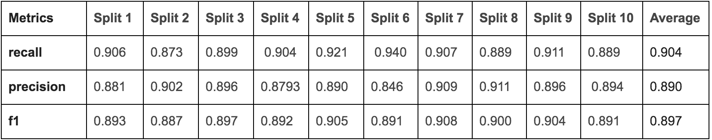
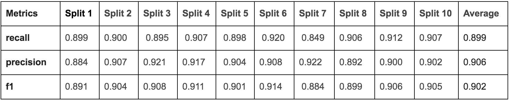
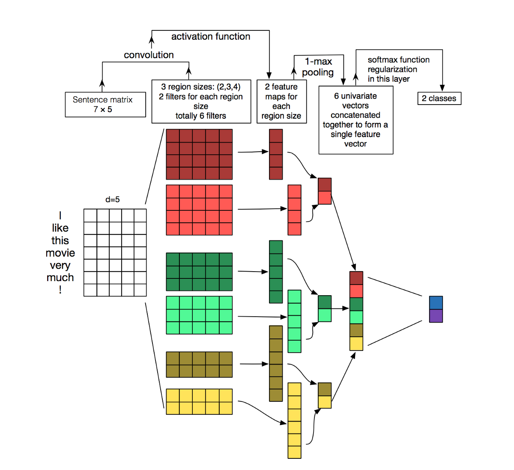
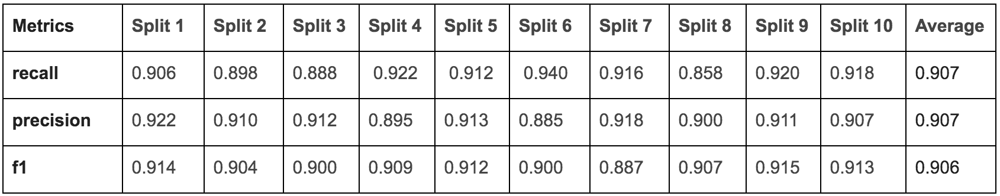

# Toxic Text Classification Report
Link to Report: https://docs.google.com/document/d/1fKOzErfzN-hjsj542BrOv3S-YGs-LaEKKYYcSyLIOTc/edit?usp=sharing

Link to Google Colab Notebook (view-only):
https://colab.research.google.com/drive/1GukAgm5Hgtz-qiZhYtrJQRSOluJ2croE

# About the Project

Since the objective is simply to identify the percentage of how toxic a piece of text is, the the only feature column that is needed is "toxic". The pieces of texts that are classified as True for any of the other forms of toxicity are also classified as True under Toxic. This means that if a piece of text is classified as "severe_toxic" or "threat", it is also classified as True for "Toxic".

## Model Architectures w/ 10-Fold Cross Validated Results

### Simple LSTM

### Bi-LSTM with Attention Mechanism

### Bi-LSTM with CNN

## Next Steps
- 1st Place Kaggle Competition Solution Overview: https://www.kaggle.com/c/jigsaw-toxic-comment-classification-challenge/discussion/52557
- Training on Upsampling
- Denser networks
- Grid Search Parameter tuning across all models
